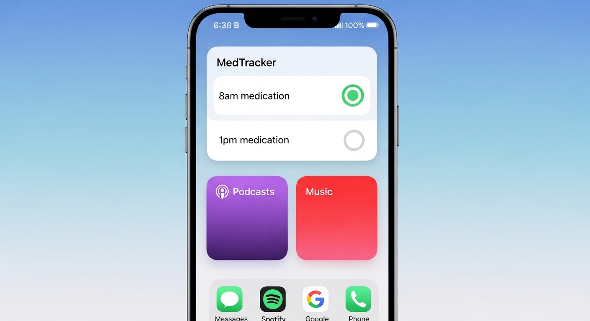

> Note: This is a foundational scaffold for a medication reminder app. Core architecture is in place; features are being developed iteratively to reflect real-world healthcare IT workflows.

# MedTracker
A medication management application designed to help patients track medication schedules, set reminders, and maintain adherence records. Built with healthcare workflows and patient safety in mind.



## Problem Being Solved
Medication non-adherence costs the US healthcare system $100-300B annually and leads to approximately 125,000 deaths per year. Patients struggle to manage complex medication schedules, especially those with multiple prescriptions or chronic conditions. MedTracker addresses this by providing an intuitive interface for medication tracking with timely reminders.

## Healthcare Context
This project demonstrates understanding of:

- **Patient-centered design**: Simple interface for users with varying technical literacy
- **Medication management workflows**: Dosage tracking, schedule management, refill reminders
- **Healthcare data considerations**: Designed with future HIPAA compliance in mind for protected health information (PHI)

**Privacy & Security:**
- Designed with HIPAA compliance principles in mind
- Local data storage options for privacy-conscious users
- Planned encryption for sensitive medication data
- No third-party data sharing without explicit consent

## Features
- **Medication Tracking**: Add, edit, and organize medications with dosage and frequency information
- **Medication Schedule**: Medication schedule creation and management
- **Smart Reminders**: Receive notifications at scheduled times for medication intake
- **Adherence Tracking**: Track whether medications were taken on time
- **Medical History**: View medication history and adherence reports

## Installation

```bash
# Clone the repository
git clone https://github.com/terra-femme/MedTracker.git
cd MedTracker

# Create virtual environment
python -m venv venv

# Activate it
source venv/bin/activate  # On Windows: venv\Scripts\activate

# Install dependencies
pip install -r requirements.txt

# Initialize database
python setup_database.py

# Run the application
python main.py
```

The application will be available at `http://localhost:8000`

### Requirements
- Python 3.9+
- pip

## Usage

[Coming Soon: instructions for how to use the app]

```bash
# Start the app
python main.py

# Add a new medication
# Set reminder time
# Receive notifications
```

## Architecture

```
MedTracker/
├── backend/               # FastAPI backend
├── frontend/              # HTML/CSS/JS frontend
├── main.py                # Entry point
├── requirements.txt
├── setup_database.py
├── .gitignore
└── README.md
```

## Tech Stack
- **Backend**: Python with FastAPI
- **Frontend**: HTML/CSS with JavaScript
- **Database**: SQLite (development), designed to scale to PostgreSQL
- **Architecture**: REST API with separate frontend/backend

## Technologies Used
- Python 3.9+
- FastAPI
- SQLite
- HTML/CSS/JavaScript

## Current Status & Roadmap
- [x] Basic project structure
- [ ] User authentication
- [ ] Medication database
- [ ] Reminder system
- [ ] Notification system
- [ ] Adherence tracking dashboard

**Status**: Active Development — v0.1.0 (Foundational scaffold)

## Development

### Contributing
1. Create a feature branch: `git checkout -b feature/your-feature`
2. Make your changes and commit: `git commit -m "Add your feature"`
3. Push: `git push origin feature/your-feature`
4. Create a Pull Request on GitHub

### Running Tests
```bash
pytest tests/
```

## License
MIT License — Feel free to use this project as reference or foundation

## Author
Kristy aka Terra Femme — Aspiring Healthcare IT Engineer | Focused on modular workflows, Git hygiene, and FHIR-aligned development

> This project is part of my portfolio demonstrating healthcare IT skills and FHIR integration knowledge.
